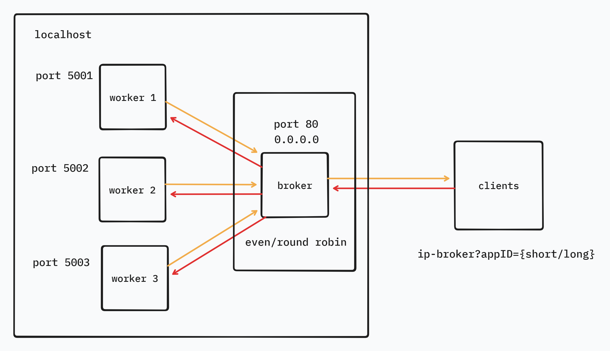

Simple Load Balancing Python
---
# Deskripsi repositori
Repositori ini dibuat dengan tujuan memenuhi tugas pada mata kuliah Komunikasi Berbasis Jaringan. Pada repositori ini berisi code dan documentation. Repositori ini membuat sebuah sistem load balancer sederhana dengan python. Berikut flowchart sederhana

1. client mengirimkan request kepada server dengan queryParameter appID. AppID digunakan sebagai identity proses yang akan dijalankan pada server. Ketika appID long, maka server akan memproses data dalam kurun waktu yang lebih lama dibandingkan dengan appID short. 
2. Broker akan menerima response dari client dan akan memilah worker mana yang harus di proses permintaan client tersebut. Pemilahan worker menggunakan dua metode yaitu even dan round robin, even akan memilih worker dengan request paling sedikit, sedangkan round robin akan memilih worker secara berurutan.
3. Worker akan menerima response dari broker, dilakukan parsing parameter untuk memilih proses mana yang akan dijalankan. worker akan memberikan response yang akan dikirimkan ke broker
4. Broker menerima response dan meneruskan response ke client.
5. Client menerima response dari hasil pemrosesan data di worker.

## Direktori `codes`:
1. `broker.py` - *Menerima response client dan mengarahkan ke worker tertentu*
2. `worker.py` - *Memproses response client dan memberikan response*
3. `client.py` - *Melakukan simulasi request client ke server*

## Direktori `documentation`:
1. `broker.md` - *penjelasan, overview broker.py*
2. `worker.md` - *penjelasan, overview worker.py*
3. `client.md` - *penjelasan, overview client.py*
4. `simulation.md` - *penjelasan simulasi load balancing*

# Informasi mahasiswa*
Nama : Rayyan Nur Fauzan
NIM : 24051905011
