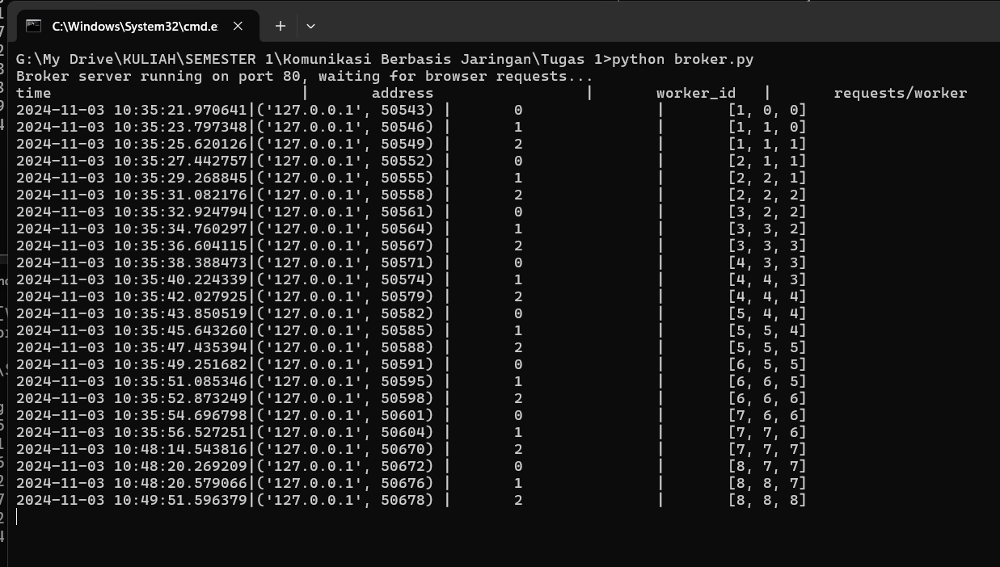

# Simulasi Percobaan Simple Load Balancer
## Run Worker server
> python worker.py --port 5001
> python worker.py --port 5002
> python worker.py --port 5003
## Run Broker server
opsional env --port. Nilai default 80 (HTTP port)
> python broker.py
## Run client 
### menggunakan program
> python client.py --id long/short --loop 20

melakukan request ke server dengan iterasi yang ditentukan
##### Tampilan terminal client

gambar diatas menampilkan 20 request ke server dengan jenis proses short sebanyak 20 kali. Dapat dilihat worker yang memproses bergantian antara 5001, 5002, atau 5003.
##### Tampilan broker

##### Tampilan worker 0 (port 5001)

##### Tampilan worker 1 (port 5002)

##### Tampilan worker 2 (port 5003)

### menggunakan web browser
##### Tampilan web browser

##### Tampilan broker

Muncul dua request baru pada worker 1 dan 2. Request pertama merupakan get ke favicon.ico, maka tidak dilanjutkan prosesnya. Sedangkan worker index kedua yaitu port 5003 yaitu request get ke localhost/appID=long, maka akan di proses dan akan memberikan response yang bisa dilihat ditampilan website
